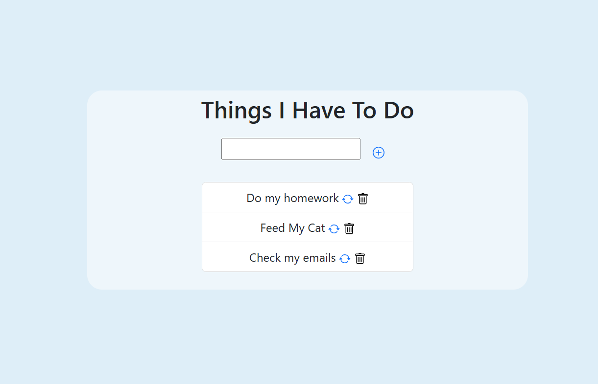
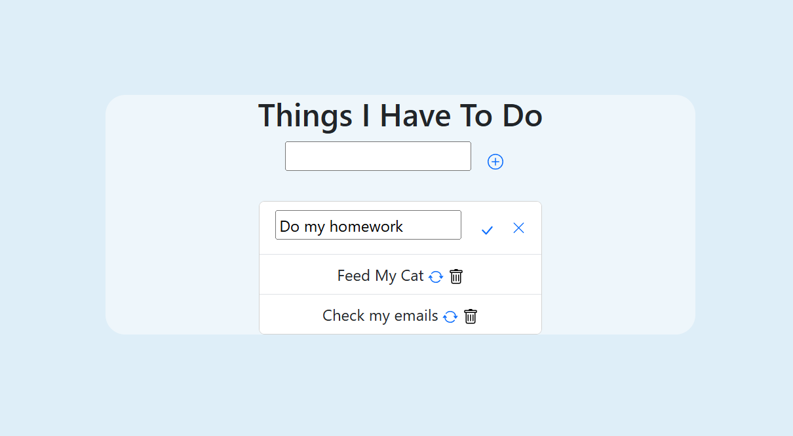

# To Do List

A full-stack **To Do List** application built with **Node.js, Express, MongoDB, and Mongoose**, featuring a responsive front-end using **HTML, CSS, and Bootstrap**.  
The app allows users to manage tasks easily with an intuitive interface and persistent storage.

---

## 🌟 Features
- Add new tasks
- Edit tasks
- Delete tasks
- Responsive and user-friendly interface

---

## 🖼 Screenshots

**Home Page:**

**Task Edit Page:**

